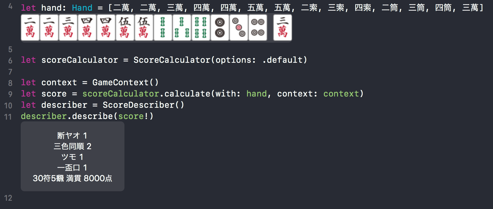

# Peafowl

[](https://swift.org)
[](https://github.com/Carthage/Carthage)
[](https://github.com/giginet/Peafowl)
[](https://github.com/cookpad/RxSpriteKit/blob/master/LICENSE)

:mahjong: *Peafowl* is a score calculation library to play Japanese Mahjong!

## Usage

```swift
// You can define hand as an array literal.
// Last tile will be picked tile.
let hand: Hand = [二萬, 二萬, 三萬, 四萬, 四萬, 五萬, 五萬, 二索, 三索, 四索, 二筒, 三筒, 四筒, 三萬]

let context = GameContext()
let score = scoreCalculator.calculate(with: hand, context: context)
let describer = ScoreDescriber()
let scoreReport = describer.describe(score!)
```



You'll get score reports.

```
三色同順 2
一盃口 1
ツモ 1
断ヤオ 1
30符5飜 満貫 8000点
```

### GameContext

You can define game states on `GameContext` struct. (e.g. prevalent wind, seat wind, dora, riichi state or others...)

```swift
let gameContext = GameContext(winningType: .selfPick, // 自摸和了、ロン和了
                              pickedSource: .wall, // 第1順, 山, 河底, 嶺上牌
                              riichiStyle: .single, // 立直, ダブル立直
                              isOneShot: false, // 一発
                              isDealer: false, // 親
                              prevalantWind: 東, // 場風
                              seatWind: 南, // 自風
                              dora: [五萬]) // ドラ
```

## Required

- Swift 4.2
- Xcode 10 beta 6 (Recommended)
- or Xcode 9.4.1 + Some Swift 4.2 toolchain

## Playground

You can try Peafowl on Xcode Playground.

1. Clone this
2. Open `Peafowl.xcworkspace`
3. Open `Peafowl.xcplayground`


## Installation

```
github "giginet/Peafowl"
```

## Acknowledgement

Tile images are provided from [here](http://majandofu.com/mahjong-images).
